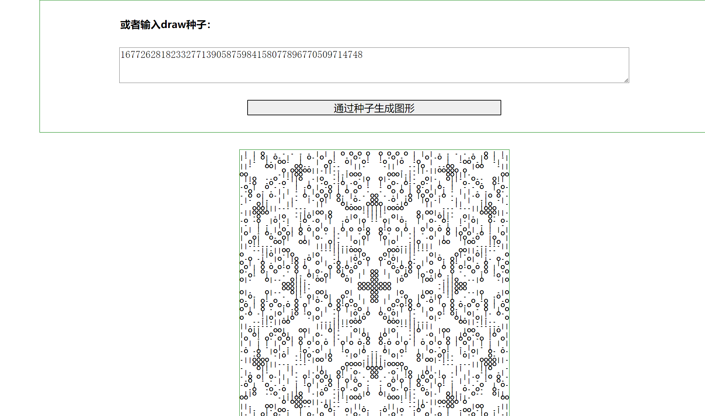

# 用法

安装：
```
npm install
```

启动节点：
```
npx hardhat compile
npx hardhat node
```

打开另一个终端：
```
cd client
npm install
npm run serve
```

访问：
```
http://localhost:8080
```

可以在第一个输入框输入代码，具体请参考etherscan合约中的draw方法输出。

也可以在第二个输入框输入seed。

也可以在contracts/Autoglyph.sol中调整draw函数的逻辑，以测试不同逻辑如何生成不同的图形。

