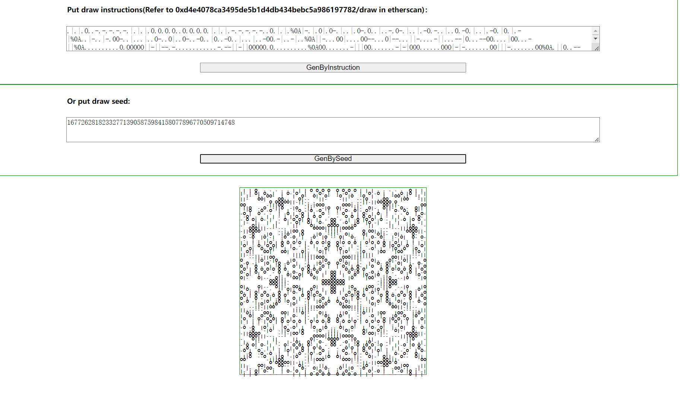

# AutoglyphsViewer

Autoglyphs is kind of "generative art" which generates image by smart contract on ethereum.

This repository is a tool run autoglyphs in local hardhat network. Users can exploit this tool to test different seed, code, or logic, to see what images can be generated.

Install：
```
npm install
```

Start local node:

```
npx hardhat compile
npx hardhat node
```

Open another terminal:
```
cd client
npm install
npm run serve
```

Access the tool in browser:

```
http://localhost:8080
```

You can put the input, that generated from "draw" method in etherscan ,into the first textarea;

You can also put your seed into the second textarea, and the default seed is the seed that created the first autoglyphs.

You can even modify the contract in contracts folder to furthur investigate how these modifications affect the image.

